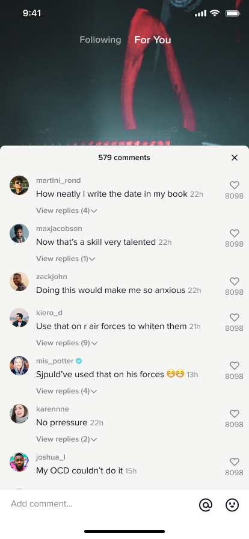

# TikTok UI Exam

## Thong tin sinh vien

- Ho ten: Trần Tiến Khải
- MSSV: 23810310384
- Lop: D18CNPM5

## Mo ta bai lam

Project mo phong 3 man hinh TikTok theo file Figma:

- Home (Following)
- Home (For You)
- Comments

Dieu huong duoc to chuc nhu sau:

- `Top Tabs Navigator` de chuyen doi giua `Following` va `For You`
- `Bottom Tabs Navigator` de di chuyen giua `Home` va `Comments`

## Chuc nang man hinh Comments

Man hinh `Comments` duoc lam theo huong gan voi trai nghiem TikTok thuc te:

- Mo man hinh comments khi nguoi dung nhan vao icon comment o cum action ben phai video
- Giu lai background video phia sau va hien panel comments tu duoi len
- Hien danh sach comments voi avatar, ten nguoi dung, thoi gian va so tim
- Cho phep like va unlike tung comment
- Cho phep mo va dong replies cua tung comment
- Cho phep nhap comment moi va gui truc tiep trong o `Add comment...`
- Cap nhat tong so comments sau khi them comment moi
- Dong panel comments de quay ve dung man hinh `Following` hoac `For You` truoc do

## Huong dan chay project

1. Cai dependencies:

```bash
npm install
```

2. Chay Expo:

```bash
npx expo start
```

3. Mo app bang Expo Go hoac Android/iOS emulator.

## Cau truc thu muc chinh

- `App.js`: khai bao navigator va 3 man hinh
- `figma/`: cac anh export tu Figma duoc dung de canh layout
- `screenshots/`: anh chup cho 3 man hinh theo yeu cau de bai

## Anh chup man hinh

### Home (Following)


### Home (For You)


### Comments


